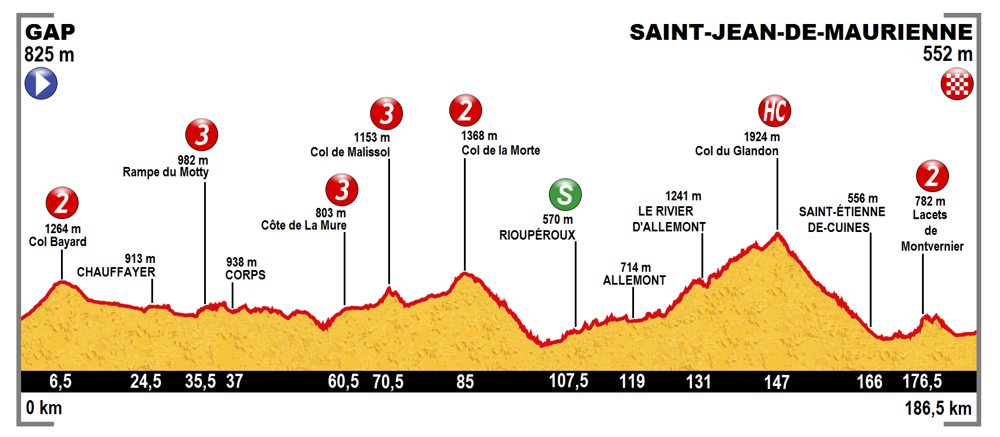

% The Tour de France (2017) 
% Jackson Witzke
% 31 July, 2017

# Tour de France

<aside class="notes">
The Tour de France is the most elite cycling race that happens every year in July that consists of 21 stages across 23 days. The race goes all across France (as the name suggestions), but it also goes into other countries as well. For example, this year the Tour de France started in Düsseldorf, Germany. There are three main 
</aside>

# The Race

<aside class="notes">
The Tour consists of three sub races, as well as the overall general classification (or GC) race. The three sub-races include the Mountains classification (for climbers), the Points classifications (for sprinters), and the Young Riders classification. 
</aside>

# Yellow Jersey

.jpg)

The leader of the race!

<aside class="notes">
The Yellow Jersy is given to the leader of the overall GC race. It is a huge honor to wear the yellow jersey for even just a day. If you are watching the race, the bright yellow jersey is the person to look out for!The leader of the General Classification is determined by Overall time from start to finish of each stage added up.
</aside>

# Green Jersey

.jpg)

<aside class="notes">
The Green Jersey is given to the leader of the points classification. The points classificiation is based off of points where the riders sprint at certain checkpoints and at the end of each stage. Flatter stages frequently have more points available to be earned for the points classification. (add video as example)
</aside>

# Polka Dot Jersey

.jpg)

<aside class="notes">
The Polka Dot Jersey is given to the leader of the Mountains classification. The Mountains Classification is based off of points earned by getting over the climbs and mountain stages the quickest. The more difficult the mountain climbed the more points available to be earned towards winning the mountains classification.  
</aside>

# White Jersey

<aside class="notes">
The White Jersey is worn by the leader of the Young Riders classification. The Young Riders race opperates the exact same as the GC race, just the contenders have to be under the age of 26, which may see pretty old for sports. However, cyclist do not normally peak until around the age of 30 
</aside>

# Stages

<aside class="notes">
The Tour Consists of 23 days. That include 21 days of riding stages, and 2 rest days. There are three main stage types. Mountain/Hilly, Flat, Time Trials. Mountain and Hilly stages are around 120-170 km and can consist of ruthless climbs that can get up to 20% incline. The flat stages are around 175-225 km and will typically end with a large bunch sprint with most of the overall contenders finishing together. Time Trials are much shorter stages and each individual rider rides seperately from everyone else. Riders are are on very areodynamic bikes that look very similar to triatholon bikes. These stages consist around 15-30 km and are done as fast as possible.
</aside>

